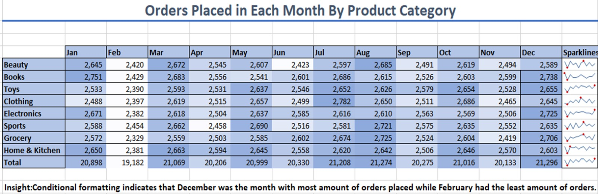
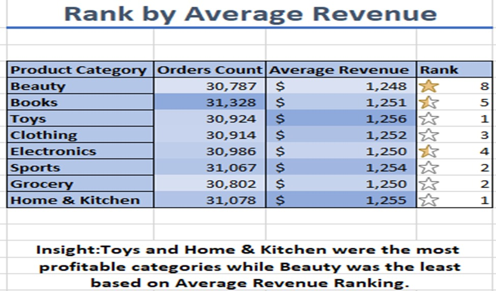

# 🛒 Store Sales Insights (Excel Project with Conditional Formatting)

## 📌 Project Overview  
This project presents an **Excel-based analysis of store sales data** using **conditional formatting and formulas**.  
The analysis highlights important **key performance indicators (KPIs)** to better understand how different product categories perform over time.  

---

## 🎯 Objectives  
- Collected raw dataset from **Kaggle**  
- Designed an **eye-catching conditional formatting table** for store sales analysis  
- Focused on KPIs such as:  
  - Orders count by month for each product category  
  - Monthly sales trends using **sparklines**  
  - Ranking by average revenue of product categories  

---

## ⚙️ Features & Functions Used  
The following Excel functions and tools were used in this project:  
- `UNIQUE` – Extract product categories  
- `COUNTIF` – Count monthly orders by category  
- `AVERAGEIF` – Calculate average revenue  
- `RANK` – Rank categories by revenue  
- **Conditional Cell Formatting** – Highlight KPIs for quick insights  
- **Sparklines** – Visualize monthly sales trends  

---

## 🛠️ Key Insights  

### 1. Orders by Month  
- December had the **highest orders**, driven by **Christmas and New Year’s Eve**.  
- February had the **lowest orders**, likely due to being the shortest month.  

---

### 2. Revenue Ranking by Category  
- **Toys** and **Home & Kitchen** were the most profitable categories.  
- **Beauty** ranked the lowest in terms of average revenue.  

---

## 📂 Project Structure  
📁 store-sales-insights-excel
┣ 📄 README.md
┣ 📊 Store_Sales_Insights.xlsx
┣ 📄 Project_Description.pdf
┗ 📁 images
┣ Insight#1.jpeg
┗ Insight#2.jpeg

---

## 🤝 Contribution  
Contributions, suggestions, and feedback are welcome!  
Feel free to fork the repository and submit pull requests.  

---

## 📧 Contact  
Author: **Shahid Abbas**  
Email: [shahidabbas2104514@gmail.com](mailto:shahidabbas2104514@gmail.com)  
